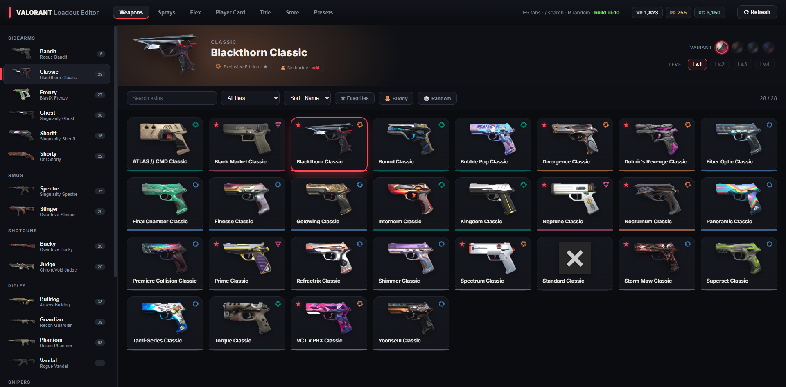
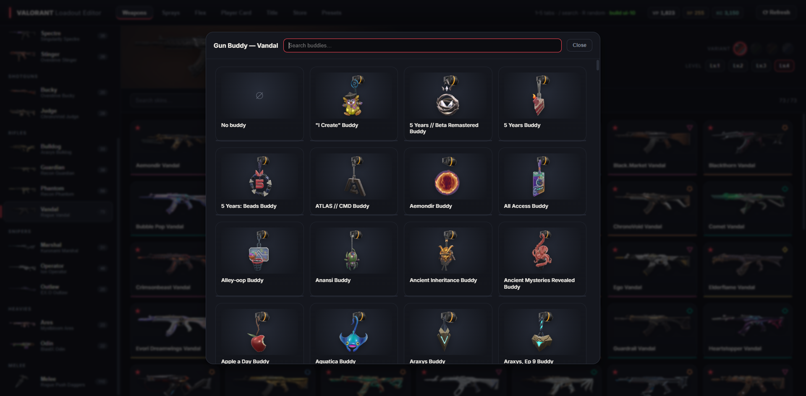
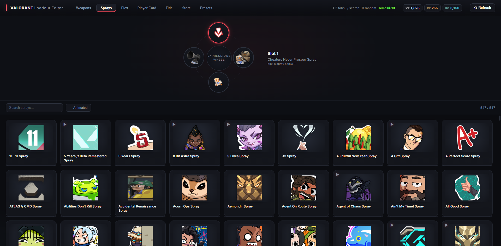
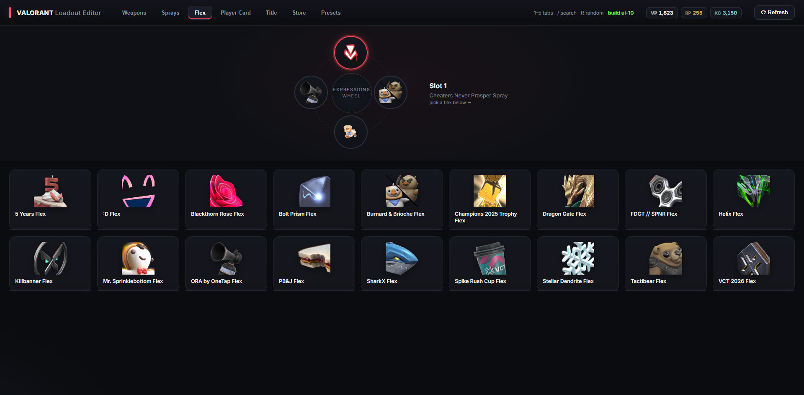
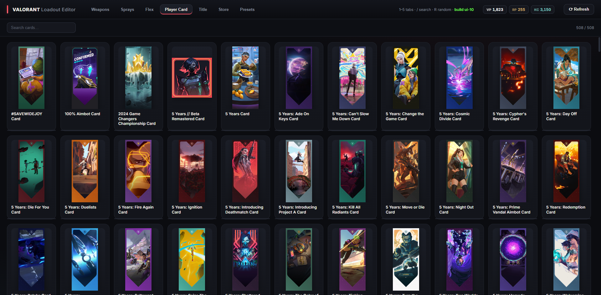
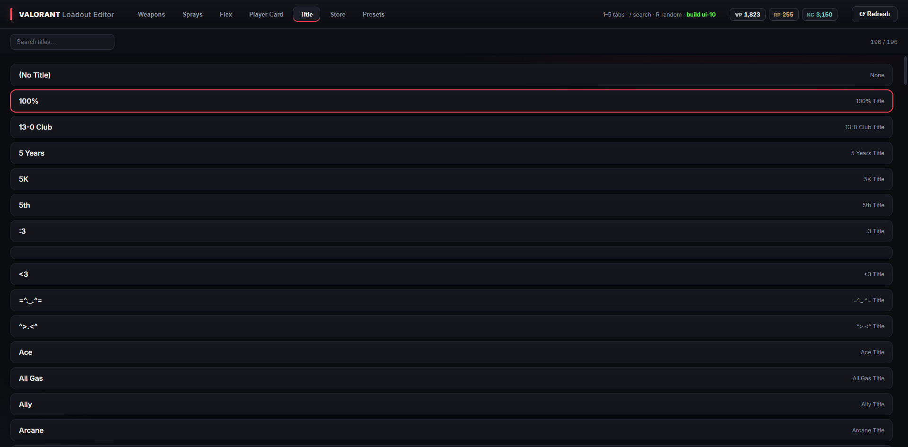
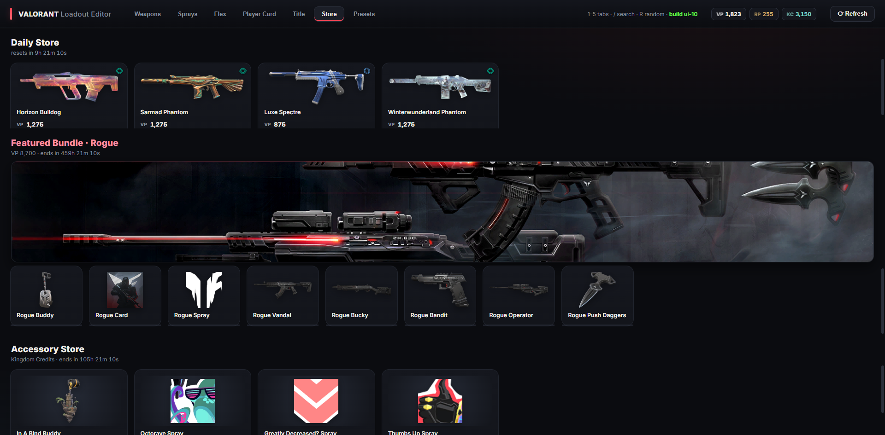

# Loadout Editor

**English** | [日本語](#日本語)

A standalone tool to edit your **VALORANT loadout** — weapon skins (with chromas
& levels), gun buddies, sprays, flex, player card and title — **without launching
the game**. Only the **Riot Client** needs to be running and logged in.

It also shows your **wallet** (VP / RP / KC) and the current **Store** (daily
offers, Featured Bundle, Accessory Store), and supports **loadout presets** that
can auto-apply per map or per agent while you play.

> **Status:** `alpha`.
>
> This tool reads and writes your loadout through Riot's internal API. That is a
> gray area with respect to Riot's third-party rules — **use at your own risk.**
> Not affiliated with or endorsed by Riot Games.

## Features

- **Browser GUI** with skin previews, rarity colours, search/tier/favorite filters and sort
- **Weapons** — skin + chroma (variant) + level + gun buddy, applied instantly
- **Sprays & Flex** — the in-game 4-slot Expressions wheel
- **Player Card** and **Title**
- **Store** — daily store, Night Market, Featured Bundle, Accessory Store (with live countdowns)
- **Wallet** — VP / RP / KC shown in the header
- **Presets** — save full loadouts and one-click apply; optional **auto-override by Map or Agent** (while in a match)

## Screenshots

| Gun Buddy | Sprays |
| :-: | :-: |
|  |  |
| **Flex** | **Player Cards** |
|  |  |
| **Title** | **Store** |
|  |  |

## Usage

**The Riot Client must be open and logged in** (you do *not* need to launch VALORANT).

### From source

1. Install [Python 3.8 or newer](https://www.python.org/downloads/) (add it to PATH).
2. Run **`INSTALL.bat`** (or `pip install -r requirements.txt`).
3. Run **`loadout.bat`** — a browser tab opens with the editor.

Keep the console window open while using the editor; press `Ctrl+C` there to close it.

## Notes

- Changes are saved to Riot's servers immediately, but VALORANT only shows them the
  next time it loads your loadout (re-open the Collection, start a match, or restart
  the client).
- The Map/Agent auto-override only works **while VALORANT is running**, because the
  current map/agent only exist during agent select / a match.
- Skin/spray/etc. images come from [valorant-api.com](https://valorant-api.com/).

## Disclaimer

THIS PROJECT IS NOT ASSOCIATED OR ENDORSED BY RIOT GAMES. Riot Games and all
associated properties are trademarks or registered trademarks of Riot Games, Inc.
Use of this software is done at your own risk.

---

# 日本語

[English](#loadout-editor) | **日本語**

**ゲームを起動せずに** VALORANT の**ロードアウト**（武器スキン＝クロマ/レベル込み、
ガンバディ、スプレー、Flex、プレイヤーカード、タイトル）を編集できる単体ツールです。
**Riot Client** が起動・ログインしていれば動きます（VALORANT 本体の起動は不要）。

あわせて**ウォレット**（VP / RP / KC）と現在の**ストア**（デイリー / Featured Bundle /
アクセサリーストア）を表示し、マップやエージェントごとに自動適用できる
**ロードアウトプリセット**にも対応します。

> **ステータス：** `alpha`
>
> 本ツールは Riot の内部 API を通じてロードアウトを読み書きします。これは Riot の
> サードパーティ規約上グレーな領域です — **自己責任でご利用ください。**
> Riot Games とは一切関係なく、公認もされていません。

## 機能

- **ブラウザGUI** — スキンプレビュー、レアリティ色、検索 / Tier / お気に入りフィルタ・並び替え
- **武器** — スキン＋クロマ（バリアント）＋レベル＋ガンバディを即時反映
- **スプレー & Flex** — ゲーム内と同じ4スロットの Expressions ウィホイール
- **プレイヤーカード** と **タイトル**
- **ストア** — デイリーストア / ナイトマーケット / Featured Bundle / アクセサリーストア（カウントダウン付き）
- **ウォレット** — ヘッダーに VP / RP / KC を表示
- **プリセット** — ロードアウトをまるごと保存してワンクリック適用。任意で **マップ/エージェント別の自動適用**（試合中のみ）

## スクリーンショット

| ガンバディ | スプレー |
| :-: | :-: |
|  |  |
| **Flex** | **プレイヤーカード** |
|  |  |
| **タイトル** | **ストア** |
|  |  |

## 使い方

**Riot Client を起動してログインしておいてください**（VALORANT 本体の起動は不要）。

### ソースから実行

1. [Python 3.8 以上](https://www.python.org/downloads/) をインストール（PATH に追加）。
2. **`INSTALL.bat`** を実行（または `pip install -r requirements.txt`）。
3. **`loadout.bat`** を実行 — ブラウザのタブでエディタが開きます。

使用中はコンソール窓を開いたままにしてください。閉じるときはその窓で `Ctrl+C` を押します。

## 注意

- 変更は Riot のサーバーに即保存されますが、VALORANT 側の表示は次にロードアウトを
  読み込んだとき（コレクションを開き直す / 試合に入る / クライアント再起動）に反映されます。
- マップ/エージェントの自動適用は **VALORANT 起動中のみ**動作します（現在のマップ/エージェントは
  エージェントセレクトや試合中にしか存在しないため）。
- スキンやスプレー等の画像は [valorant-api.com](https://valorant-api.com/) から取得しています。

## 免責事項

本プロジェクトは RIOT GAMES とは関係なく、公認もされていません。Riot Games および
関連するすべての資産は Riot Games, Inc. の商標または登録商標です。本ソフトウェアの
利用は自己責任で行ってください。
